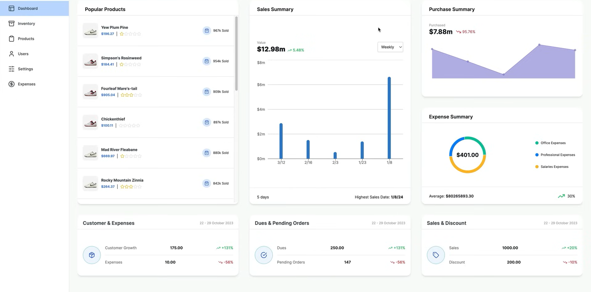
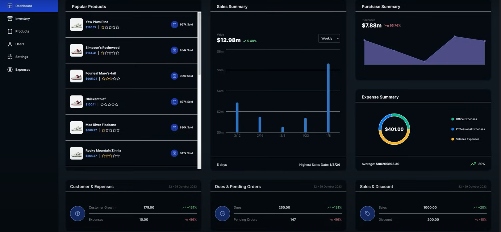
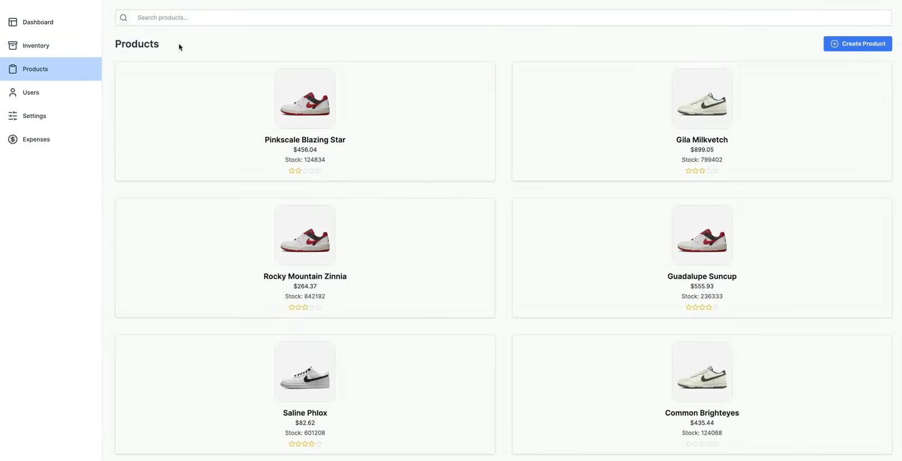
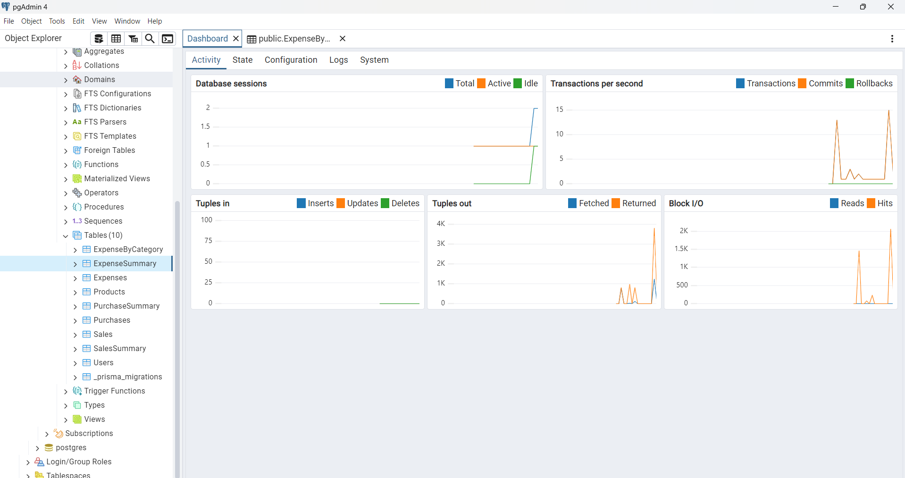

# Inventory Management Dashboard

This is a **Next.js Inventory Management Dashboard** designed to streamline the management of inventory data. Built with modern technologies and deployed on AWS, this project provides an efficient and scalable solution for inventory management.

---

## Features

- **Real-time Inventory Tracking**: Monitor stock levels, incoming shipments, and outgoing orders.
- **User Management**: Assign roles and permissions for admins, managers, and staff.
- **Dynamic Data Visualization**: Interactive charts and graphs for better insights.
- **Customizable Alerts**: Get notified when stock is low or orders are delayed.
- **AWS Integration**: Leverages EC2, RDS, and S3 for deployment and storage.

---

## Tech Stack

### Frontend
- **Next.js**: For server-rendered React components.
- **Tailwind CSS**: For responsive and modern UI.

### Backend
- **Node.js**: Handles API endpoints.
- **PostgreSQL**: Relational database for inventory data.

### Deployment
- **AWS EC2**: For hosting the application.
- **AWS RDS**: For database management.
- **AWS S3**: For storing images and assets.

---

## Screenshots

### Dashboard Overview


### Dark Theme Overview


### Inventory Page 


### Database Postgres 



## Installation

1. Clone the repository:
   ```bash
   git clone https://github.com/your-username/inventory-dashboard.git
   ```

2. Navigate to the project directory:
   ```bash
   cd inventory-dashboard
   ```

3. Install dependencies:
   ```bash
   npm install
   ```

4. Set up environment variables in a `.env` file:
   ```env
   DATABASE_URL=<your-database-url>
   AWS_ACCESS_KEY_ID=<your-aws-access-key>
   AWS_SECRET_ACCESS_KEY=<your-aws-secret-key>
   AWS_REGION=<your-aws-region>
   ```

5. Start the development server:
   ```bash
   npm run dev
   ```

6. Visit `http://localhost:3000` in your browser.

---


